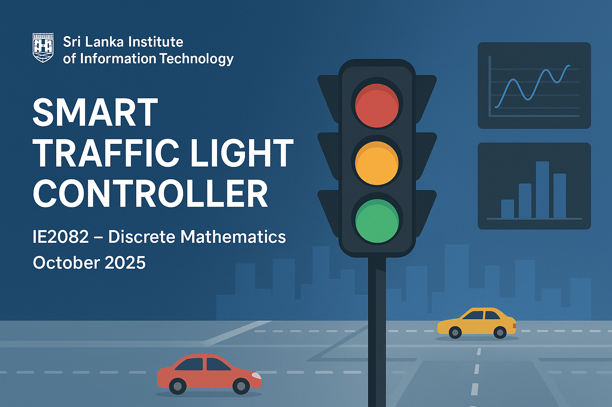
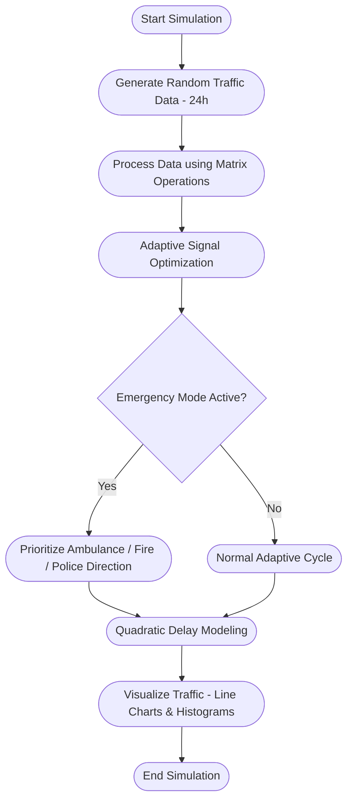

 

  

# 🚦 Smart Traffic Light Controller 

### Sri Lanka Institute of Information Technology (SLIIT)  
📘 **Course:** IE2082 – Discrete Mathematics  
📅 **Completed:** October 2025  

---

## 🧠 About the Project  
Designed and developed an **AI-inspired Smart Traffic Light Controller** that dynamically optimizes signal timings at a busy intersection using **GNU Octave**.  
This intelligent system adapts to **real-time traffic density**, prioritizes **emergency vehicles**, and models **congestion patterns** — combining **programming, mathematical logic, and data visualization** into a single adaptive solution.

---

## ✨ Key Highlights  

🕹️ Simulated **24-hour real-world traffic flow** for a 4-direction, 6-lane intersection.  
💡 Integrated **adaptive signal logic** using conditional statements and switch-case control.  
🚨 Built an **emergency mode system** that prioritizes ambulances, fire trucks, and police vehicles.  
📊 Created **visual dashboards** (line charts & histograms) for traffic density and distribution.  
🧮 Applied **quadratic modeling** to analyze traffic delay and congestion levels.  
⚡ Utilized **vectorized matrix operations** for faster and more efficient computation.  

---

## 💻 Tools & Technologies  
`GNU Octave` · `MATLAB Concepts` · `Data Visualization` · `Logical & Mathematical Modeling` · `Algorithmic Thinking`

---

## 🎯 Outcomes & Learnings  
- Applied **Discrete Mathematics** to solve a real-world optimization problem.  
- Strengthened **logical reasoning**, **analytical thinking**, and **programming efficiency**.  
- Gained experience in building **data-driven, simulation-based control systems**.  
- Enhanced **teamwork and documentation** skills through collaboration.  

## 🧩 System Overview  

## 👥 Team Members  

- **W.A.M. Umayanga**  
- **S.R.D. Senadheera**  
- **M.M.N. Matharaarachchi**  
- **M.G.M.D.P. Karunarathna**  

---

## 🏁 Conclusion  

This project successfully demonstrated how **mathematical logic** and **programming principles** can be combined to build a **real-world intelligent traffic system**.  
It showcases the power of **Discrete Mathematics**, **algorithmic optimization**, and **data visualization** in solving practical engineering challenges.  

